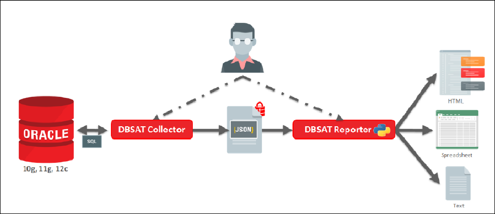

# Bonus Lab 5: Repeating DBSAT to Compare to Baseline

This lab takes the Participates through running DBSAT again and comparing the results with the initial run.



## Disclaimer ##

<em>The following is intended to outline our general product direction. It is intended for information purposes only, and may not be incorporated into any contract. It is not a commitment to deliver any material, code, or functionality, and should not be relied upon in making purchasing decisions. The development, release, and timing of any features or functionality described for Oracle’s products remains at the sole discretion of Oracle.</em>

## Requirements ##

* Instructions in this lab expect that you have completed all the previous labs in the workshop.
* SSH Session connected to **secdb** as user **oracle**

## Step 1 : Unzip DBSAT Companion Utilities ##

Run **dbsat60\_prepare.sh** to copy locally previous DBSAT reports and unzip DBSAT companion utilities including the **dbsat\_diff tool**.

````
[oracle@secdb]$ <copy>cd /home/oracle/HOL/lab10_dbsat</copy>
````

````
[oracle@secdb lab10_dbsat]$ <copy>dbsat60_prepare.sh</copy>

Archive:  dbsat_util.zip
  inflating: work/dbsat_diff
  inflating: work/dbsat_extract
````

## Step 2 : Run DBSAT Collect ##

Enter password **oracle** to protect the output file.

````
[oracle@secdb lab10_dbsat]$ <copy>dbsat70_collect2.sh</copy>

Database Security Assessment Tool version 2.1 (March 2019)

(...)

Connecting to the target Oracle database...

(...)

Setup complete.
SQL queries complete.
OS commands complete.
Disconnected from Oracle Database 18c Enterprise Edition Release 18.0.0.0.0 - Production
Version 18.5.0.0.0
DBSAT Collector completed successfully.

Calling /u01/oracle/db/prod/18c/ee/bin/zip to encrypt dbsat_pdb1_2.json...

Enter password: oracle
Verify password: oracle
  adding: dbsat_pdb1_2.json (deflated 89%)
zip completed successfully.
````

## Step 3 : Generate a DBSAT Collect report ##

Use again password **oracle** to protect the report.

````
[oracle@secdb lab10_dbsat]$ <copy>dbsat80_report2.sh</copy>

Database Security Assessment Tool version 2.1 (March 2019)

(...)

Archive:  dbsat_pdb1_2.zip
[dbsat_pdb1_2.zip] dbsat_pdb1_2.json password: oracle
  inflating: dbsat_pdb1_2.json
DBSAT Reporter ran successfully.

Calling /usr/bin/zip to encrypt the generated reports...

Enter password: oracle
Verify password: oracle
        zip warning: dbsat_pdb1_2_report.zip not found or empty
  adding: dbsat_pdb1_2_report.txt (deflated 78%)
  adding: dbsat_pdb1_2_report.html (deflated 83%)
  adding: dbsat_pdb1_2_report.xlsx (deflated 3%)
  adding: dbsat_pdb1_2_report.json (deflated 81%)
zip completed successfully.
````

## Step 4 : Unzip the report file ##

Unzip the report file to be able to check the contents by opening it in Firefox. You will be asked for the password to unzip. Input **oracle** when requested.

````
[oracle@secdb lab10_dbsat]$ <copy>cd /home/oracle/HOL/lab10_dbsat/work</copy>
````

````
[oracle@secdb work]$ <copy>unzip dbsat_pdb1_2_report.zip</copy>

Archive:  dbsat_pdb1_2_report.zip
[dbsat_pdb2_report.zip] dbsat_pdb1_2_report.txt password: oracle
  inflating: dbsat_pdb1_2_report.txt
  inflating: dbsat_pdb1_2_report.html
  inflating: dbsat_pdb1_2_report.xlsx
  inflating: dbsat_pdb1_2_report.json
````

## Step 5 : Compare DBSAT reports ##

You can run dbsat90_compare.sh to generate all the differences between the first DBSAT report and this one.

````
[oracle@secdb work]$ <copy>dbsat90_compare.sh</copy>

(...)
< dbsat_pdb1_report.json: CONT PDB1 (PDB:3) Wed Mar 06 2019 10:02:00
---
> dbsat_pdb1_2_report.json: CONT PDB1 (PDB:3) Thu Mar 07 2019 18:39:00

Assessment Date & Time
< Date of Data Collection  Date of Report           Reporter Version
< ------------------------ ------------------------ -----------------------
< Wed Mar 06 2019 10:02:00 Wed Mar 06 2019 10:13:30 2.1 (March 2019) - 7a38
---
> Date of Data Collection  Date of Report           Reporter Version
> ------------------------ ------------------------ -----------------------
> Thu Mar 07 2019 18:39:00 Thu Mar 07 2019 18:43:42 2.1 (March 2019) - 7a38

Database Version
< Oracle Database 18c Enterprise Edition Release 18.0.0.0.0 - Production
< Security options used: (none)
---
> Oracle Database 18c Enterprise Edition Release 18.0.0.0.0 - Production
> Security options used: Advanced Security, Database Vault, Label Security
(...)
````

Congratulations: The Workshop is now complete!

## Acknowledgements

- **Authors** - Adrian Galindo, PTS LAD & François Pons, PTS EMEA - Database Product Management - May 2020.
- **Credits** - This lab is based on materials provided by Oracle Database Security Product Management.
